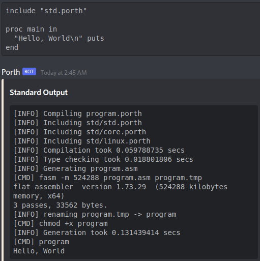

# Porth Bot

Discord bot that runs Porth codeblocks inside a Docker

### Usage
Place [Porth] code inside a codeblock using the porth language marker  
\`\`\`porth  
include "std.porth"  

proc main in  
  "Hello, World\n" puts  
end  
\`\`\`

### Development (Virtual Environment)
Dependencies: [Python], [Poetry], and [Docker]  
1. Clone the repository
2. Build the docker image: `docker build -t porth .`
3. Select python version: `poetry env use <python executable>`
4. Install dependencies: `poetry install`
5. Run the bot: `env DISCORD_TOKEN="token here" poetry run porthbot`

### Production (System Python)
Dependencies: [Python], [Poetry], and [Docker]  
1. Clone the repository
2. Build the docker image: `docker build -t porth .`
3. Build the discord bot: `poetry build`
4. Install dependencies: `pip install --user hikari`
5. Install the package: `pip install --user dist/*.tar.gz` or `pip install --user dist/*.whl`
5. Run the bot: `env DISCORD_TOKEN="token here" porthbot`

[Porth]:  https://gitlab.com/tsoding/porth
[Python]: https://python.org
[Poetry]: https://python-poetry.org
[Docker]: https://docker.com